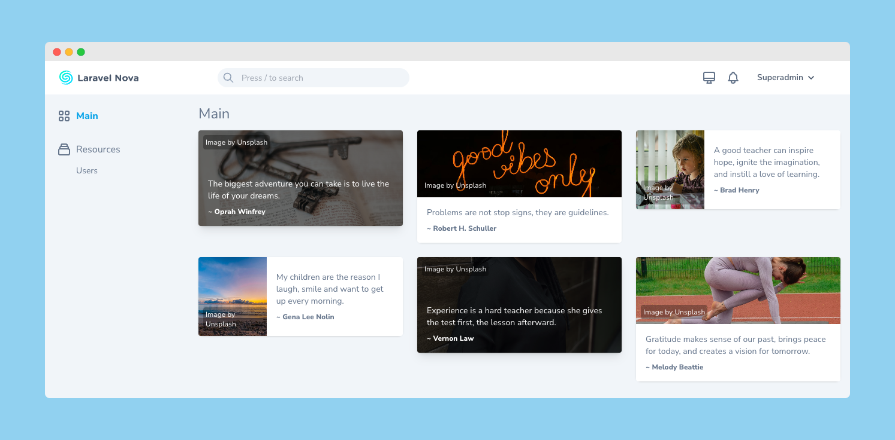

# Nova Inspire



> The best way to connect with your customers is by reaching out and inspiring them.
>
> ~ Me

## Installation

You can install the package in to a [Laravel](http://laravel.com) app that uses [Nova](http://nova.laravel.com) via composer :

```cli
composer require devtical/nova-inspire
```

## Usage

Add the card to your `NovaServiceProvider.php`

```php

use Devtical\Inspire\Inspire;

// ...

public function cards()
{
    return [
        // ...
        (new Inspire())->options([
            'topic'   => 'peace',   // null, motivational, learning, etc
            'style'   => 'stacked', // default, stacked, horizontal
        ]),
    ];
}
```

### Topics

-   `experience`
-   `humor`
-   `learning`
-   `life`
-   `morning`
-   `motivational`
-   `music`
-   `peace`
-   `poetry`
-   `teacher`
-   `thankful`
-   `time`
-   `relax`
-   More (soon..)

## License

The MIT License (MIT).
